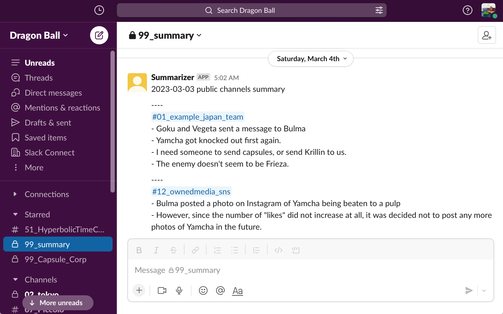

# Script for summarizing Slack public channels using ChatGPT

[日本語はこちら](./README.ja.md)

by [masuidrive](https://twitter.com/masuidrive) @ [Bloom&Co., Inc.](https://www.bloom-and-co.com/) 2023-
[APACHE LICENSE, 2.0](https://www.apache.org/licenses/LICENSE-2.0)



This script uses OpenAI's ChatGPT API to create and post a summary of a Slack public channel.

In organizations where the number of channels is increasing, it can be difficult to keep up with reading all the activity. By creating and posting summaries, it is easier to keep track of channel activity.

Most of this code was written using ChatGPT. If you have any better prompts or feature enhancements, please submit a Pull Request.

Please check OpenAI's terms and conditions of information handling for yourself, including the following

https://platform.openai.com/docs/data-usage-policies

If you have any questions, please feel free to contact me on http://twitter.com/masuidrive_en or http://twitter.com/masuidrive.

## How to set it up on GitHub Actions

It runs on GitHub Actions every day at 5:00 a.m., so if you want to run it in a different environment, you'll have to figure it out.

### Fork it to your own GitHub account

- Click the "Fork" button in the upper right to fork it to your own repository.
- Make the GitHub Actions executable by upgrading to a paid plan or some other means.

### Edit running time

- GitHub Actions uses the cron syntax to schedule jobs, which is specified in the `.github/workflows/summarizer.yaml` file with the `minute hour * * *` format.
- Since this is in UTC, you need to adjust for your own time zone.
- For example, to run the script every day at 5:00 AM in Japan, you would specify `0 20 * * *` to run it at 8:00 PM UTC the day before.

### Set environment variables

- Open the "Settings" tab and click "Secrets and variables"->"Actions".
- Click the green "New Repository Secret" button to set environment variables for the following three variables.


#### OPEN_AI_TOKEN

- OpenAI's authentication token
- Access [OpenAI's website](https://platform.openai.com/).
- Click the "Sign In" button on the upper right and log in to your account.
- Click "API Key" from the "API" menu at the top of the page to generate an API key.
- When you access the "API Key" page, the API key will be displayed. Copy it and paste it into Value.

#### SLACK_BOT_TOKEN

- Slack's API authentication token
- Access the [Slack API website](https://api.slack.com/) and log in.
- Click "Create a new app" and select "From an app manifest", and copy the following contents to the manifest.

```
{"display_information":{"name":"Summary","description":"Public channelのサマリーを作る","background_color":"#d45f00"},"features":{"bot_user":{"display_name":"Summary","always_online":false}},"oauth_config":{"scopes":{"bot":["channels:history","channels:join","channels:read","chat:write","users:read"]}},"settings":{"org_deploy_enabled":true,"socket_mode_enabled":false,"token_rotation_enabled":false}}
```

- Click "Install App" on the left side of the screen, then click "Install App to Workspace" that appears on the right side to install the app in your workspace. Once the installation is complete, the bot's OAuth access token will be displayed.
- Copy this token that begins with `xoxb-` and paste it into Value.

#### SLACK_POST_CHANNEL_ID

- The channel_id in Slack where you want to post the summary result
- Open the Slack channel where you want to post the summary results.
- Click the channel name at the top and paste the Channel ID, which appears at the bottom of the popup window.

#### LANGUAGE

- Specifies the language used for summarization.
- Any value can be specified, such as "ja" or "Japanese" for Japanese, or "en" or "English" for English.

#### TIMEZONE

- Specifies the timezone for the primarily read region.
- Specify in the "TZ database name" format, such as "Asia/Tokyo" or "America/New_York".
- See https://en.wikipedia.org/wiki/List_of_tz_database_time_zones

### Install the bot in the channel

- Search for "Summary" in the search window at the top of the screen and click "Summary [APP]".
- Click "Summary" and click "Add this app to a channel" to specify the channel where you want to post the summary results.

### Run

- Open the "Settings" tab in the GitHub repository, then click "Actions"->"General" on the left side.
- Select "Allow all actions and reusable workflows" in "Actions permissions" and save it.

With these settings, a summary of Slack's public channels will be posted every day at 5:00 a.m.

you would manually execute it by opening the "Actions" tab, clicking on "Summary" on the left, and clicking "Run workflow" on the right.
